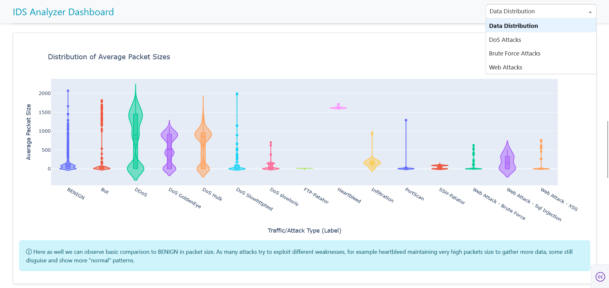
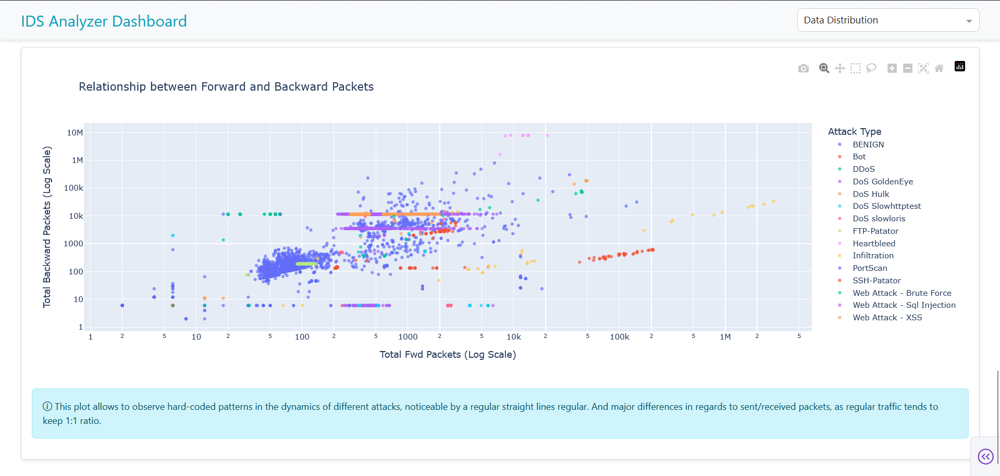
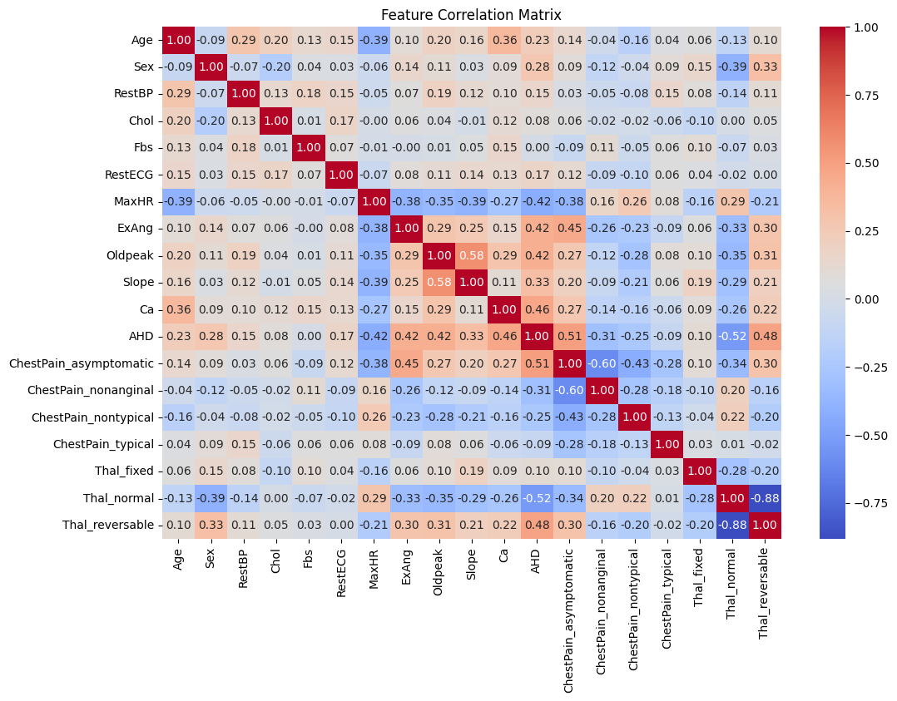

# Analysis and Visualization of Network Attacks using an IDS Dataset

## Project Overview

Cybersecurity increasingly relies on big data analysis to understand and detect attacks.
IDS (Intrusion Detection Systems) collect network logs that help identify suspicious
behaviors. This project proposes to use a [CIC-IDS 2017](https://www.unb.ca/cic/datasets/ids-2017.html) dataset to explore and analyze these
data, and to build an interactive dashboard.


## Authors

- **Piotr Szkoda** ([GitHub](https://github.com/PhoXinuS))
- **Martyna Kochalska** ([GitHub](https://github.com/pyskaa0506))
- **Marten Tschatschandise**

## Technologies Used

-   **Language**: Python 3.11
-   **Data Analysis**: Pandas, NumPy
-   **Visualization**: Matplotlib, Seaborn, Plotly
-   **Web Framework**: Dash
-   **Machine Learning**: Scikit-learn, TensorFlow/Keras
-   **Hosting**: Render.com

## Installation and Usage

### Installation
**Make sure to use a virtual environment with Python 3.11.**
Clone the repository and install the required dependencies.


```bash
# Clone the repository
git clone https://github.com/PhoXinuS/IDS-Analyzer.git
cd IDS-Analyzer

# Create and start virtual environment
python -m venv venv
source venv/bin/activate  # On Windows: venv\Scripts\activate

# Install dependencies
pip install -r /dash_dashboard/requirements.txt
```

**Download Dataset from [CIC-IDS 2017](https://www.unb.ca/cic/datasets/ids-2017.html) and put it unpacked inside the "data" folder**

Watch out! It must be a full .csv version containing **timestamps**, not the reduced one that is accessible on Kaggle.

Additionaly, the datasets should be processed using the data_expansion.py

### Running the Project

## To run the Dash dashboard, execute:

```bash
cd .\dash_dashboard\
python .\app.py
```
After that, open your web browser and navigate to `http://127.0.0.1:8050` to access the dashboard.

### Examples

## Dashboard Screenshots




## Data Analysis Visualizations


